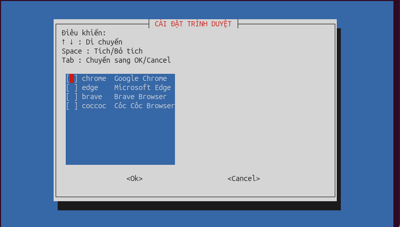

# ubuntu-dev-setup
## Hướng dẫn cài đặt

trước tiên hãy cập nhật danh sách các gói phần mềm mới nhất cùng phiên bản của chúng từ kho lưu trữ. Mục đích để hệ thống biết được những thay đổi mới nhất và có thể cài đặt hoặc nâng cấp các phần mềm một cách an toàn và chính xác.

```update
sudo apt update
```
Để cài đặt tất cả các công cụ một cách nhanh chóng hãy chạy lệnh sau:

```bash

```

nếu muốn cài từng công cụ có thể tham khảo các file script tương ứng phía dưới đây:
## Trình duyệt web
Lý do từ "trình duyệt" được dùng ở dạng số nhiều rất đơn giản: việc có nhiều trình duyệt web cho phép bạn phân chia việc sử dụng từng trình duyệt cho một mục đích cụ thể. Ví dụ:
<ol>
    <li>Microsoft Edge</li>
    <li>Cốc Cốc</li>
    <li>Brave</li>
    <li>Google Chrome</li>
</ol>
lệnh cài đặt các trình duyệt sau:
<p>(chạy lệnh xong mọi người có thể chọn trình duyệt nào muốn cài rồi cài nhé)</p>

```push
bash -c "$(curl -fsSL https://raw.githubusercontent.com/foxrolong/ubuntu-dev-setup/main/browser.sh)"
```

<div align="center">
  
</div>

## Môi trường lập trình

**Curl**
```
sudo apt install curl
```
**VS Code**
```bash
bash -c "$(curl -fsSL https://raw.githubusercontent.com/foxrolong/ubuntu-dev-setup/main/install.sh)"
```
**Vietnamese input (IBus unikey)**
```

```
**Git**
```

```
